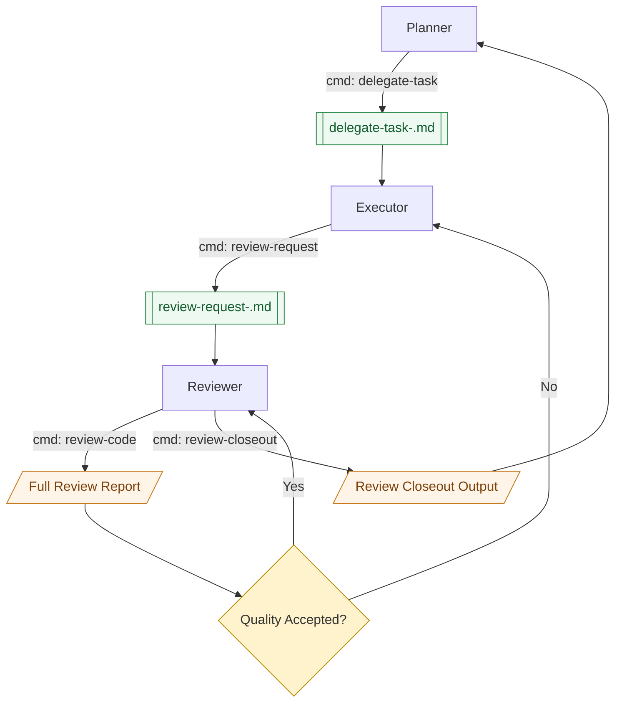

# Skills Workflow

This document describes the multi-agent workflow built around the skills in this directory.

## Roles

- Agent 1, **Planner** (`delegate-task`): planning agent, generates implementation task documents.
- Agent 2, **Executor** (implementation): executes tasks and applies code changes.
- Agent 3, **Reviewer** (`review-code`): review agent, produces full review reports.
- User: orchestrates copy/paste handoff between agents and makes acceptance decisions.

## Core Artifacts

- Delegate task file: `delegate-task-<unique>.md`
- Review request file: `review-request-<unique>.md`
- Full review report: direct output from Agent 3 (copy/paste by user)
- Closeout summary: direct output from `review-closeout` (copy/paste by user)

## End-to-End Loop

1. User asks Agent 1 to prepare work.
2. Planner runs `delegate-task` and creates `delegate-task-<unique>.md`.
3. User sends that task document to Agent 2.
4. Executor implements changes.
5. Executor runs `review-request` and creates `review-request-<unique>.md`.
6. User sends that review request document to Agent 3.
7. Reviewer runs `review-code` and outputs a full review report (with PASS/FAIL/UNKNOWN checks).
8. User sends the full review report back to Executor for fixes.
9. Repeat steps 4-8 until the user decides quality is acceptable.
10. After acceptance, Reviewer runs `review-closeout` to produce a concise closeout summary (direct output, no file).
11. User sends the closeout summary to Planner for final planning context.
12. Executor and Reviewer can be fully exited.

## Flow Diagram

## Operational Notes

- `review-code` remains the authoritative full review output.
- `review-closeout` is a closeout extractor for final handoff, not a replacement for full review.
- Use copy/paste handoff strictly to keep each agent session isolated and disposable.
- Diagram conventions:
  - Edge label `cmd: ...` means a skill command invocation.
  - `[[...]]` is a temporary document artifact.
  - `[/.../]` is direct report output (copy/paste).

## Incremental Automation with Agent Deck

The baseline flow above remains valid. `agent-deck` can be added gradually without switching to full automation.

Current recommended operating mode:

1. Keep `planner` as a long-lived session.
2. Create `executor-<task_id>` and `reviewer-<task_id>` per task.
3. Keep user confirmation as the gate before final acceptance/closeout.
4. Keep long payloads file-based (`delegate-task`, `review-request`, `review-report`, `closeout`).

Use skill:

- `agent-deck` (`ai-agent/skills/agent-deck/SKILL.md`)

References:

- CLI reference: `ai-agent/skills/agent-deck/references/cli-reference.md`
- Message templates: `ai-agent/skills/agent-deck/references/message-templates.md`
