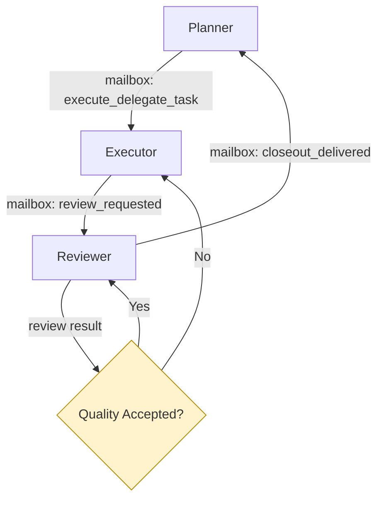

# Skills Workflow

This document describes the multi-agent workflow built around the skills in this directory.

## Roles

- Agent 1, **Planner** (`delegate-task`): planning agent, prepares the execution brief and sends it through mailbox
- Agent 2, **Executor** (implementation): executes tasks and applies code changes
- Agent 3, **Reviewer** (`review-code`): review agent, produces the full review report directly in mailbox body
- User: makes acceptance decisions when the workflow is human-gated

## Core Transport

- `agent-mailbox` is the authoritative workflow message layer
- `agent-deck` is used either to start target sessions into mailbox-wait mode or to nudge already active sessions to check mail
- Workflow messages live in mailbox `subject` + `body`
- When sending mailbox body text, prefer `agent-mailbox send --body-file -` and feed stdin directly
- Prefer `adwf-send-and-wake` for cross-session workflow delivery
- In Codex-style environments, launch `adwf-send-and-wake --body-file -` in a background terminal / PTY session and write body text to that session's stdin
- Run every `agent-mailbox` command outside sandbox
- Run mailbox state-mutating `agent-mailbox` commands serially, not in parallel
- The workflow does not generate Markdown handoff files by default

## End-to-End Loop

1. User asks Planner to prepare work.
2. Planner runs `delegate-task`, starts Executor into `check-workflow-mail wait=True` when needed, or nudges the existing Executor session, then sends one delegate mailbox message.
3. Executor implements changes.
4. Executor runs `review-request`, starts Reviewer into `check-workflow-mail wait=True` when needed, or nudges the existing Reviewer session, then sends one review-request mailbox message.
5. Reviewer runs `review-code` and sends either:
   - `rework_required` back to Executor, or
   - `stop_recommended` to the user decision point.
6. If user wants another iteration, Reviewer sends `user_requested_iteration` to Executor.
7. Repeat until the user decides quality is acceptable, or policy auto-accepts.
8. After acceptance, Reviewer runs `review-closeout` and sends one closeout mailbox message to Planner.
9. Planner reads the closeout mailbox body, then batches merge/progress/next-task work.
10. Executor and Reviewer can be fully exited.

## Flow Diagram

```mermaid
flowchart TD
    P[Planner] -->|mailbox: execute_delegate_task| E[Executor]
    E -->|mailbox: review_requested| R[Reviewer]
    R -->|review result| DEC{Quality Accepted?}
    DEC -- No --> E
    DEC -- Yes --> R
    R -->|mailbox: closeout_delivered| P

    style DEC fill:#fff3cd,stroke:#b58900,stroke-width:1px
```

## Operational Notes

- `review-code` remains the authoritative full review output
- `review-closeout` is the compact planner handoff after acceptance
- The receiver should always read mailbox `body` first
- A received workflow mail is executable work, not a notification to acknowledge and ignore
- Use `check-workflow-mail` as the receiver-side wake handler
- External files are supplemental references only, not the default transport

## Incremental Automation with Agent Deck

Current recommended operating mode:

1. Keep `planner` as a long-lived session.
2. Create `executor-<task_id>` and `reviewer-<task_id>` per task.
3. Keep executor/reviewer in `check-workflow-mail wait=True` when they are idle and expecting the next workflow step.
4. Keep user confirmation as the gate before final acceptance/closeout unless workflow policy overrides it.
5. Keep workflow content in mailbox body instead of generated Markdown files.
6. Keep planner closeout actions batched after acceptance.

Use skills:

- Project workflow skill: `agent-deck-workflow` (`ai-agent/skills/agent-deck-workflow/SKILL.md`)
- Receiver wake handler: `check-workflow-mail` (`ai-agent/skills/check-workflow-mail/SKILL.md`)
- Agent Deck skill + docs bundle: `ai-agent/skills/agent-deck/SKILL.md` and `ai-agent/skills/agent-deck/references/`
