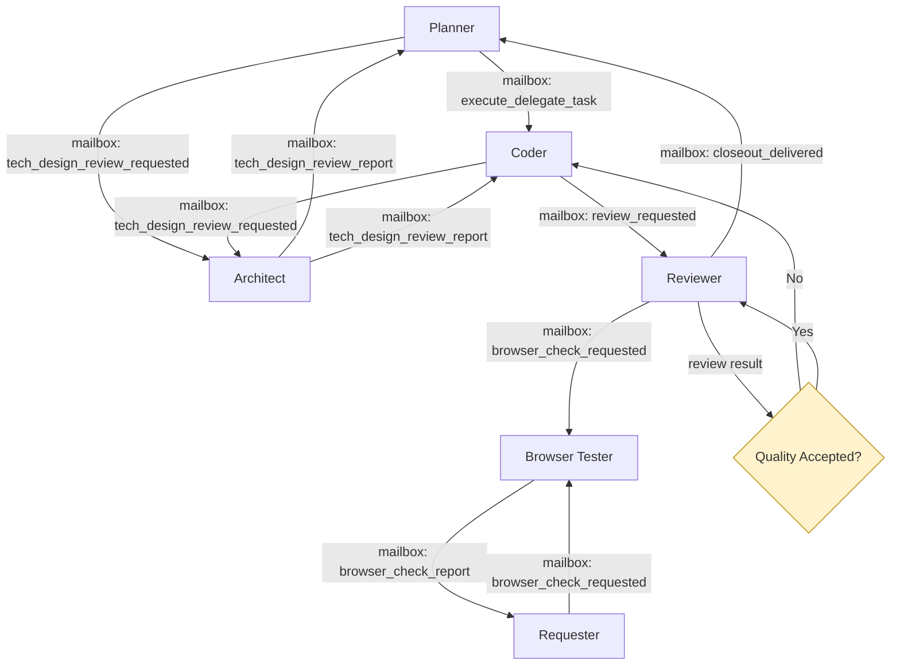

# Skills Workflow

This document describes the multi-agent workflow built around the skills in this directory.

## Roles

- Agent 1, **Planner** (`delegate-task`): planning agent, prepares the execution brief and sends it through mailbox
- Agent 2, **Coder** (implementation): executes tasks and applies code changes
- Agent 3, **Reviewer** (`review-code`): review agent, produces the full review report directly in mailbox body
- Agent 4, **Architect** (`tech-design-review`): per-topic tech-design review agent, reviews committed design docs and reports advice back to the requester session
- Agent 5, **Browser Tester** (`browser-test`): long-lived runtime validation agent, keeps browser state warm, checks behavior with `agent-browser`, and reports evidence back to the requester session
- User: makes acceptance decisions when the workflow is human-gated

## Core Transport

- `agent-mailbox` is the authoritative workflow message layer
- `agent-deck` is used to start target sessions or to nudge already active sessions to check mail
- `agent_mailbox` MCP is the default transport interface for agents
- Workflow messages live in mailbox `subject` + `body`
- use mailbox tools directly; use `mailbox_bind` only when custom addresses are needed or mailbox context is missing
- The workflow does not generate Markdown handoff files by default

## End-to-End Loop

1. User asks Planner to prepare work.
2. Planner runs `delegate-task` and sends one delegate workflow message.
3. Planner or Coder may send a committed tech-design snapshot on `tech-design/<task_id>` to `architect-<task_id>` and receive a `tech_design_review_report`.
4. Coder implements changes and commits a delivery snapshot. In delegated coder flow, that commit is already workflow-authorized and overrides generic default commit-approval rules.
5. Coder runs `review-request` from that committed state and sends one review-request workflow message.
6. Reviewer runs `review-code` and sends either:
   - `rework_required` back to Coder, or
   - `browser_check_requested` to Browser Tester, or
   - `stop_recommended` to the user decision point.
7. Browser Tester runs `browser-test` and sends `browser_check_report` back to the requester session.
8. If user wants another iteration, Reviewer sends `user_requested_iteration` to Coder.
9. Repeat until the user decides quality is acceptable, or policy auto-accepts.
10. After acceptance, Reviewer runs `review-closeout` and sends one closeout mailbox message to Planner.
11. Planner reads the closeout mailbox body, then batches merge/progress/next-task work.
12. Coder, Reviewer, and Architect can be fully exited; Browser Tester stays long-lived.

## Flow Diagram

```mermaid
flowchart TD
    P[Planner] -->|mailbox: execute_delegate_task| C[Coder]
    P -->|mailbox: tech_design_review_requested| A[Architect]
    C -->|mailbox: tech_design_review_requested| A
    A -->|mailbox: tech_design_review_report| P
    A -->|mailbox: tech_design_review_report| C
    C -->|mailbox: review_requested| R[Reviewer]
    R -->|mailbox: browser_check_requested| B[Browser Tester]
    X[Requester] -->|mailbox: browser_check_requested| B
    B -->|mailbox: browser_check_report| X
    R -->|review result| DEC{Quality Accepted?}
    DEC -- No --> C
    DEC -- Yes --> R
    R -->|mailbox: closeout_delivered| P

    style DEC fill:#fff3cd,stroke:#b58900,stroke-width:1px
```

## Operational Notes

- `review-code` remains the authoritative full review output
- `tech-design-review` is a separate advisory lane for committed design docs; it does not replace code review
- `review-request` should record coder-run lint / build / compile / test results so reviewer can usually reuse them instead of rerunning the same slow checks
- `browser-test` is primarily runtime evidence; when explicitly allowed, Browser Tester may directly adjust display-adjacent code on its own branch before reporting back
- requester should provide browser-test login/auth/setup context whenever possible; Browser Tester may ask requester or user for missing access details
- `review-closeout` is the compact planner handoff after acceptance
- The receiver should always read mailbox `body` first
- A received workflow mail is executable work, not a notification to acknowledge and ignore
- Use `check-agent-mail` as the receiver-side wake handler
- External files are supplemental references only, not the default transport

## Incremental Automation with Agent Deck

Current recommended operating mode:

1. Keep `planner` as a long-lived session.
2. Create `coder-<task_id>`, `reviewer-<task_id>`, and `architect-<task_id>` per task; keep `browser-tester` as a reusable long-lived session.
3. Queue mail first, then nudge the non-local target to run `check-agent-mail`.
   A newly created or newly started target should run `mailbox_wait` for its first mail before that first check.
4. Keep user confirmation as the gate before final acceptance/closeout unless workflow policy overrides it.
5. Keep workflow content in mailbox body instead of generated Markdown files.
6. Keep planner closeout actions batched after acceptance.

Use skills:

- Project workflow skill: `agent-deck-workflow` (`ai-agent/skills/agent-deck-workflow/SKILL.md`)
- Receiver wake handler: `check-agent-mail` (`ai-agent/skills/check-agent-mail/SKILL.md`)
- Tech-design review request: `tech-design-review-request` (`ai-agent/skills/tech-design-review-request/SKILL.md`)
- Architect review: `tech-design-review` (`ai-agent/skills/tech-design-review/SKILL.md`)
- Browser check request: `browser-test-request` (`ai-agent/skills/browser-test-request/SKILL.md`)
- Browser tester: `browser-test` (`ai-agent/skills/browser-test/SKILL.md`)
- Agent Deck skill + docs bundle: `ai-agent/skills/agent-deck/SKILL.md` and `ai-agent/skills/agent-deck/references/`
