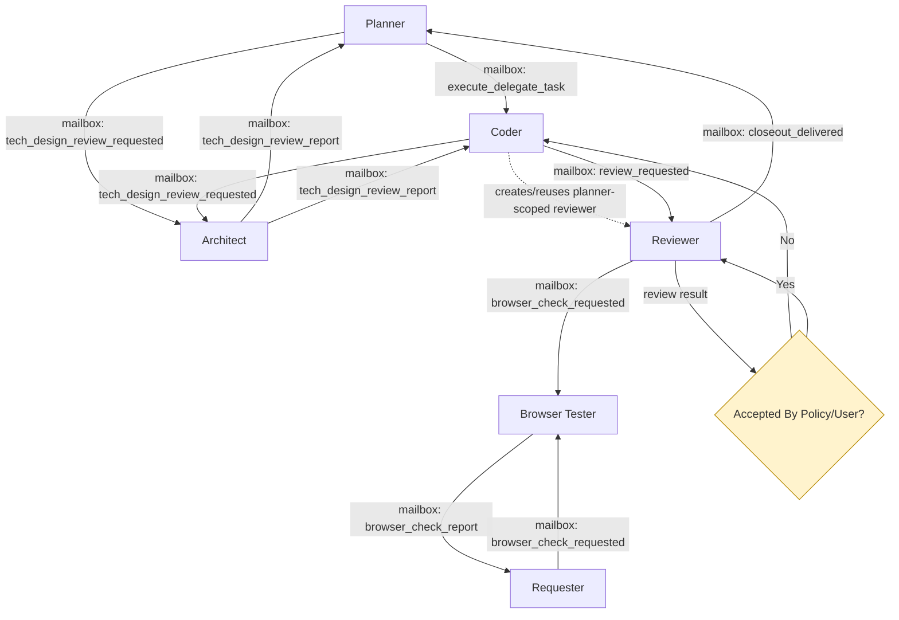

# Skills Workflow

This document describes the multi-agent workflow built around the skills in this directory.

For prompt-authoring rules and known pitfalls, see `PROMPT-WRITING.md`.

## SKILL.md Audience

`SKILL.md` is runtime instruction text for the agent executing that skill.
Write it for the agent that is doing the work now, not for the person maintaining the repo.

Keep these out of `SKILL.md`:
- prompt-authoring notes
- repo-maintenance reminders
- "this file intentionally..." explanations
- editing guidance about where future rules should live
- stale-guidance cleanup notes for future maintainers

Put those into maintenance docs such as this `README.md` instead.

Use `SKILL.md` for:
- execution steps
- runtime constraints
- decision rules the executing agent must follow
- references or scripts the executing agent should load or use

## Roles

- Agent 1, **Planner** (`delegate-task`, `execute-plan`, `planner-closeout`): planning agent, prepares execution briefs, can execute a supervisor-assigned task list inside one workspace, and completes planner-side closeout
- Supervisor: generic upstream report target; may dispatch a plan to a planner and receive one final plan report back
- Agent 2, **Coder** (implementation): executes tasks and applies code changes
- Agent 3, **Reviewer** (`review-code`): review agent, produces the full review report directly in mailbox body
- Agent 4, **Architect** (`tech-design-review`): per-topic tech-design review agent, reviews the latest committed design docs on a branch and reports advice back to the requester session
- Agent 5, **Browser Tester** (`browser-test`): usually a reusable long-lived runtime validation agent, keeps browser state warm when available, checks behavior with `agent-browser`, and reports evidence back to the requester session
- Refactor Reviewer (`refactor-review`): advisory reviewer that inspects existing code for duplication and simplification opportunities without making changes
- User: makes acceptance decisions only when the workflow explicitly requires human gating

## Core Transport

- `agent-mailbox` is the authoritative workflow message layer
- `agent-deck` is used to start target sessions or to nudge already active sessions to check mail
- `agent_mailbox` MCP is the default transport interface for agents
- Workflow messages live in mailbox `subject` + `body`
- use mailbox tools directly; use `mailbox_bind` only when custom addresses are needed or mailbox context is missing
- The workflow does not generate Markdown handoff files by default

## End-to-End Loop

1. User asks Planner to prepare work.
2. Planner runs `delegate-task` and sends one delegate workflow message.
3. Planner or Coder may request architect review for the latest committed tech-design docs on `tech-design/<task_id>`.
4. Coder implements changes and commits a delivery snapshot. In delegated coder flow, that commit is already workflow-authorized and overrides generic default commit-approval rules.
5. Task-level review is planner-controlled: when per-task review is required, coder runs `review-request`; that skill creates or reuses the reviewer on demand as a child of planner, or returns control to planner without reviewer involvement when review is skipped.
6. Reviewer runs `review-code` and sends either:
   - `rework_required` back to Coder, or
   - `browser_check_requested` to Browser Tester, or
   - `stop_recommended` to the workflow acceptance gate.
7. Browser Tester runs `browser-test` and sends `browser_check_report` back to the requester session.
8. If user wants another iteration, Reviewer sends `user_requested_iteration` to Coder.
9. Repeat until quality is acceptable under workflow policy; unattended mode auto-accepts no-must-fix results by default unless the user or policy explicitly requires a human gate.
10. After acceptance, Reviewer runs `review-closeout` and sends one closeout mailbox message to Planner.
11. Planner runs `planner-closeout` from that `closeout_delivered` body and batches merge/progress/next-task work.
12. Coder, Reviewer, and Architect can be fully exited; Browser Tester stays long-lived.

## Supervisor-To-Planner Plan Execution

1. Supervisor runs `dispatch-plan` and sends one `execute_plan` message to a planner.
2. That planner owns one workspace and the internal task decomposition needed to complete the assigned goal.
3. Planner delegates non-trivial implementation tasks; for trivial code tasks it may self-implement, but then acts as coder for commit, review, and closeout.
4. For each task, planner may choose `Per-task review: required` or `skip`.
5. After the assigned goal is complete, planner may request one final integrated review from its own integration branch.
6. Planner sends one `plan_report_delivered` summary back to supervisor.
7. After receiving a completed report with no open items, supervisor merges the planner integration branch, then cleans up the planner-owned structure for that run.

## Flow Diagram

```mermaid
flowchart TD
    P[Planner] -->|mailbox: execute_delegate_task| C[Coder]
    P -->|mailbox: tech_design_review_requested| A[Architect]
    C -->|mailbox: tech_design_review_requested| A
    A -->|mailbox: tech_design_review_report| P
    A -->|mailbox: tech_design_review_report| C
    C -. creates/reuses planner-scoped reviewer .-> R[Reviewer]
    C -->|mailbox: review_requested| R
    R -->|mailbox: browser_check_requested| B[Browser Tester]
    X[Requester] -->|mailbox: browser_check_requested| B
    B -->|mailbox: browser_check_report| X
    R -->|review result| DEC{Accepted By Policy/User?}
    DEC -- No --> C
    DEC -- Yes --> R
    R -->|mailbox: closeout_delivered| P

    style DEC fill:#fff3cd,stroke:#b58900,stroke-width:1px
```

## Operational Notes

- `review-code` remains the authoritative full review output
- `tech-design-review` is a separate advisory lane for committed design docs; it does not replace code review
- `tech-design-review-request` is a requester-owned convergence loop: keep iterating with committed doc updates until the design is deliverable or explicitly escalated to the user
- Accepted tech-design docs are product artifacts: merge the tech-design branch back into its recorded base branch with `git merge`; do not squash, rebase, cherry-pick, or copy the docs manually
- `review-request` should record coder-run lint / build / compile / test results so reviewer can usually reuse them instead of rerunning the same slow checks
- `browser-test` is primarily runtime evidence; when explicitly allowed, Browser Tester may directly adjust display-adjacent code on its own branch before reporting back
- requester should provide browser-test login/auth/setup context whenever possible; Browser Tester may ask requester or user for missing access details
- `review-closeout` is the compact planner handoff after acceptance
- `planner-closeout` is the planner-side runtime action for `closeout_delivered`
- `execute-plan` is the planner-side runtime action for a supervisor-assigned task list in one workspace
- `plan-report` is the supervisor-side runtime action for the final report from that planner
- planner-owned coder/reviewer/architect/refactor-reviewer sessions are created as child sessions through `agent_deck_create_session`; any subgroup fallback stays inside the session manager
- delegated coder flow creates or reuses reviewer only through `review-request`; reviewer must be parented to planner, not coder
- Prefer child sessions when agent Deck can represent ownership and cleanup directly.
- A planner may be top-level outside `dispatch-plan`; do not assume every planner is a child session.
- Current agent-deck session hierarchy cannot always express deeper workflow ownership once a planner is already a child; keep any subgroup/group-path fallback inside the session manager rather than the workflow contract.
- The receiver should always read mailbox `body` first
- A received workflow mail is executable work, not a notification to acknowledge and ignore
- Use `check-agent-mail` as the receiver-side wake handler
- coder/reviewer/architect progress is asynchronous and may take unbounded time; planner must not treat cross-session dispatch as a synchronous substep that will finish soon
- after cross-session dispatch, planner either does independent non-interfering work or stops; do not sleep, poll, or proactively wait for another agent's progress
- in a shared workspace, the active task worktree state is coder-owned until planner closeout begins; planner must not alter that workspace state while other agents may still be working there
- when planner self-implements a trivial code task, it must create an explicit task branch from the planner-owned integration branch, commit without routine user confirmation, run any required review, close out the task, and still send `plan_report_delivered`
- planner may skip per-task review when its current plan policy allows it; final integrated review can be requested later from the planner-owned integration branch
- Use `mailbox_list` with `state: acked` only when you need to find a specific older persisted delivery to reread
- External files are supplemental references only, not the default transport

## Incremental Automation with Agent Deck

Current recommended operating mode:

1. Keep `planner` as a long-lived session.
2. Create `coder-<task_id>` and `architect-<task_id>` per task as needed; create or reuse `reviewer-<task_id>` on demand from `review-request` with planner as parent; prefer reusing `browser-tester` as a long-lived session, but let `browser-test-request` create it on demand when missing.
3. Queue mail first, then nudge the non-local target to run `check-agent-mail`.
   Newly created or restarted targets use the same notify path; they do not need a special pre-check phase.
4. Default to unattended final acceptance/closeout; require user confirmation only when the user or workflow policy explicitly makes acceptance human-gated.
5. Keep workflow content in mailbox body instead of generated Markdown files.
6. Keep planner closeout actions batched after acceptance.
7. When supervisor finishes integrating a planner lane result, clean up the planner-owned structure that was actually used for that run.
8. Supervisor-side integration uses `git merge`; do not switch to `cherry-pick`, `rebase`, or manual history surgery unless the user explicitly asks.

Use skills:

- Project workflow skill: `agent-deck-workflow` (`ai-agent/skills/agent-deck-workflow/SKILL.md`)
- Receiver wake handler: `check-agent-mail` (`ai-agent/skills/check-agent-mail/SKILL.md`)
- Planner closeout: `planner-closeout` (`ai-agent/skills/planner-closeout/SKILL.md`)
- Plan dispatch: `dispatch-plan` (`ai-agent/skills/dispatch-plan/SKILL.md`)
- Plan execution: `execute-plan` (`ai-agent/skills/execute-plan/SKILL.md`)
- Plan report: `plan-report` (`ai-agent/skills/plan-report/SKILL.md`)
- Tech-design review request: `tech-design-review-request` (`ai-agent/skills/tech-design-review-request/SKILL.md`)
- Architect review: `tech-design-review` (`ai-agent/skills/tech-design-review/SKILL.md`)
- Browser check request: `browser-test-request` (`ai-agent/skills/browser-test-request/SKILL.md`)
- Browser tester: `browser-test` (`ai-agent/skills/browser-test/SKILL.md`)
- Refactor review request: `refactor-review-request` (`ai-agent/skills/refactor-review-request/SKILL.md`)
- Refactor advisor: `refactor-review` (`ai-agent/skills/refactor-review/SKILL.md`)
- Agent Deck skill + docs bundle: `ai-agent/skills/agent-deck/SKILL.md` and `ai-agent/skills/agent-deck/references/`
