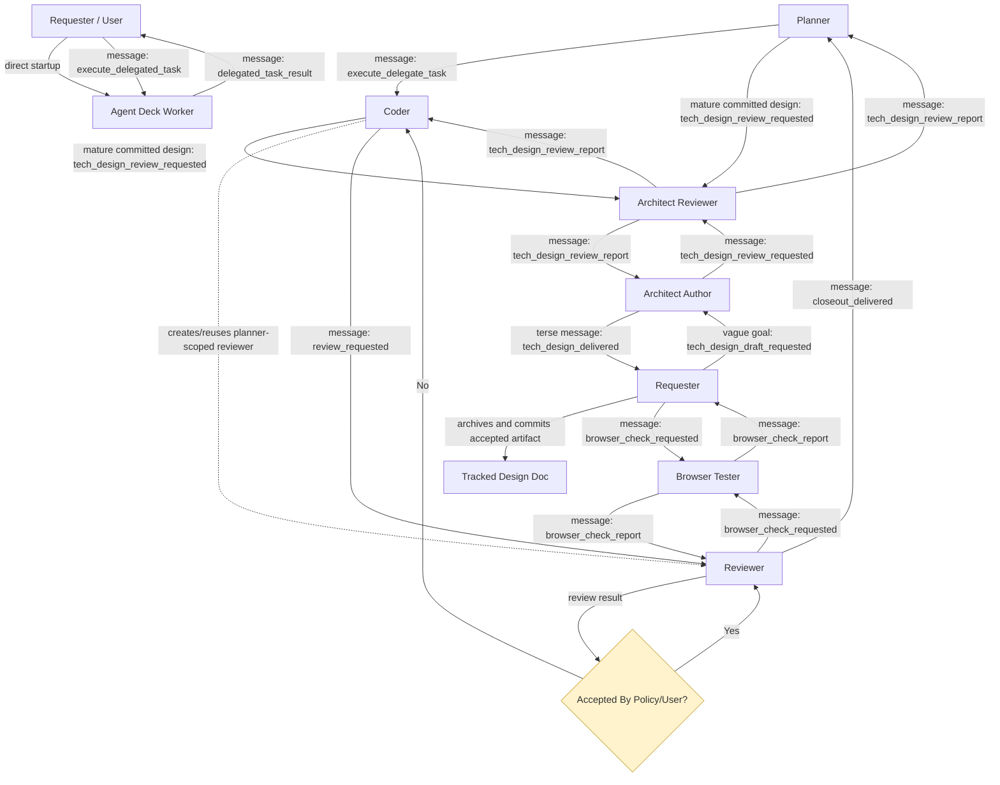

# Skills Workflow

This document describes the multi-agent workflow built around the skills in this directory.

For prompt-authoring rules and known pitfalls, see `PROMPT-WRITING.md`.

## SKILL.md Audience

`SKILL.md` is runtime instruction text for the agent executing that skill.
Write it for the agent that is doing the work now, not for the person maintaining the repo.

Keep these out of `SKILL.md`:
- prompt-authoring notes
- repo-maintenance reminders
- "this file intentionally..." explanations
- editing guidance about where future rules should live
- stale-guidance cleanup notes for future maintainers

Put those into maintenance docs such as this `README.md` instead.

Use `SKILL.md` for:
- execution steps
- runtime constraints
- decision rules the executing agent must follow
- references or scripts the executing agent should load or use

## Protocol Cutovers

Review workflow changes use a deliberate hard cut. Legacy `review_completed`,
`review-only-v2`, and Handoff recovery are unsupported. Before upgrading,
manually drain those pending deliveries; do not add runtime migration rules to
`SKILL.md`.

`agents/openai.yaml` files are Codex skill interface metadata. Keep them with the
owning skill unless replacing that skill's Codex-facing name, description, or
default prompt; they are not dead files just because this repo has no internal
reference to them.

## Explicit-Only Skills

Use explicit-only invocation for opt-in features whose primary result is a
distinct deliverable rather than a normal chat reply (currently
`explain-for-me`, `handoff`, `explore-defects`, and `tech-design-assessment`). Set both:

- Claude Code `SKILL.md`: `disable-model-invocation: true`
- Codex `agents/openai.yaml`: `policy.allow_implicit_invocation: false`

Explicit `$skill` use still works. Keep receiver, protocol, and workflow skills
implicit: they may need to run from an inbound action. Codex's generic validator
currently rejects the Claude-only field; retain it as a cross-harness exception.

## Roles

- Agent 1, **Planner** (`delegate-task`, `delegate-code-task`, `execute-plan`, `planner-closeout`): planning agent, chooses an execution surface, prepares execution briefs, can execute a supervisor-assigned task list inside one workspace, and completes planner-side closeout
- Supervisor: generic upstream report target; may dispatch a plan to a planner and receive one final plan report back
- Agent Deck Worker: persistent, named session for a bounded outcome when history must survive restarts, explicit control, later coordination, or user-visible/intervenable progress matters
- Agent 2, **Coder** (implementation): executes tasks and applies code changes
- Agent 3, **Reviewer** (`review-code`): review agent, produces the full review report directly in message body
- Agent 4, **Architect** (`tech-design-review`): per-topic tech-design reviewer for an exact immutable draft artifact or committed design snapshot
- Agent 5, **Browser Tester** (`browser-test`): usually a reusable long-lived runtime validation agent, keeps browser state warm when available, checks behavior with `agent-browser`, and reports evidence back to the requester session
- Refactor Reviewer (`refactor-review`): advisory reviewer that inspects existing code for duplication and simplification opportunities without making changes
- Roundtable Moderator (`roundtable`): user-facing discussion controller; creates Waypost group, selects participants, drains group updates, and presents synthesis
- Roundtable Participant (`roundtable-participant`): agent-deck session that reads a group stream as one participant and posts concise role-specific replies
- User: makes acceptance decisions only when the workflow explicitly requires human gating

## Execution Surfaces

- local execution: immediate work owned by the current session
- native harness subagent: short, independent parallel work with no durable session or later message coordination
- Agent Deck worker: a persistent, user-visible session with history across restarts and explicit workspace/tool control; start it directly for user-led work, or attach Waypost when a requester needs later coordination or a result

Choose the lightest surface that preserves the task's lifecycle. Parallelism alone does not justify Agent Deck. Do not use Agent Deck to emulate a native harness subagent.

`$delegate-task [$skill | skill] ...` uses only its first input token as an optional skill, classifies delivery effects, and forwards required known context/source. Code-owned work uses `delegate-code-task`.

## Core Transport

- `waypost` is the authoritative workflow message layer
- `agent-deck` is used to start or require target sessions
- `agent-deck-workflow/references/internal-protocol/shared-protocol.md` owns recv/wait, async sender, and target-status rules
- `waypost` MCP is the default transport interface for agents
- Workflow messages live in message `subject` + `body`
- use Waypost MCP tools directly; use `waypost_bind` only when custom addresses are needed or Waypost message context is missing
- The workflow does not generate Markdown handoff files by default

## End-to-End Loop

1. User asks Planner to prepare work.
2. After `delegate-task` Selection-Only Use selects a Waypost worker for a code task, Planner runs `delegate-code-task` and sends one code delegate workflow message.
3. Planner or Coder may start two-architect drafting for an unresolved goal, or request direct review of mature committed tech-design docs.
4. Coder implements changes and commits a delivery snapshot. In delegated coder flow, that commit is already workflow-authorized and overrides generic default commit-approval rules.
5. Task-level review is planner-controlled: when required, coder runs `review-request`; it creates or reuses a reviewer as a planner child. A `standalone` review has no planner or closeout; its reviewer is a requester child.
6. Reviewer runs `review-code` and sends either:
   - `rework_required` back to Coder, or
   - `browser_check_requested` to Browser Tester, or
   - `stop_recommended` to the task acceptance gate, or to requester for an accepted non-task review.
7. Browser Tester runs `browser-test`; a review-driven `browser_check_report` returns to Reviewer, otherwise to its requester.
8. If user wants another iteration, Reviewer sends `user_requested_iteration` to Coder.
9. Repeat until quality is acceptable under workflow policy; unattended mode auto-accepts no-must-fix results by default unless the user or policy explicitly requires a human gate.
10. After task acceptance, Reviewer runs `review-closeout` and sends one closeout Waypost message to Planner.
11. Planner runs `planner-closeout` from that `closeout_delivered` body and batches merge/progress/next-task work.
12. Coder, Reviewer, and Architect can be fully exited; Browser Tester stays long-lived.

## Supervisor-To-Planner Plan Execution

1. Supervisor runs `dispatch-plan` and sends one `execute_plan` message to a planner.
2. That planner owns one workspace and the internal task decomposition needed to complete the assigned goal.
3. Planner chooses local execution, a native harness subagent when available, or Agent Deck for each implementation task. Persistent Waypost Agent Deck code work uses `delegate-code-task`; local and harness code work use planner-owned branch, commit, review, and closeout.
4. For each task, planner may choose `Per-task review: required` or `skip`.
5. After the assigned goal is complete, planner may request one final integrated review from its own integration branch.
6. Planner sends one `plan_report_delivered` summary back to supervisor.
7. After receiving a completed report with no open items, supervisor merges the planner integration branch, then cleans up the planner-owned structure for that run.

## Roundtable Discussion Workflow

Use `roundtable` when the user wants a multi-agent discussion, brainstorm, critique, or advisory panel.

1. User talks only to the moderator.
2. Moderator clarifies intent, proposes participants, and creates a `group/roundtable-...` Waypost group.
3. Moderator registers itself as group notification subscriber with `waypost_group_add_subscriber`.
4. Participants are real child agent-deck sessions of the moderator, with tool commands resolved through role `roundtable_participant`.
5. Moderator sends clarified user intent to the group and nudges selected participants with personal control messages; the first turn is parallel by default, later turns are targeted unless the user asks for sequential round-robin.
6. Participants read group unread messages with `waypost_recv` plus `as_person`, then post one group reply.
7. Group subscriber updates arrive as normal personal `group_message_available` deliveries, so the moderator uses normal `check-waypost-messages` pickup and then runs `roundtable` Moderator Group Check.
8. Moderator presents synthesis to the user with per-participant `message_id` traceability; raw group history remains the source of truth.
9. Ending keeps sessions and Waypost message history by default; explicit cleanup removes participant sessions and the Agent Deck participant group after final synthesis.

## Flow Diagram

```mermaid
flowchart TD
    Q[Requester / User] -->|direct startup| W[Agent Deck Worker]
    Q -->|message: execute_delegated_task| W
    W -->|message: delegated_task_result| Q
    P[Planner] -->|message: execute_delegate_task| C[Coder]
    X[Original Requester] -->|vague goal: tech_design_draft_requested| DA[Architect Author]
    DA -->|message: tech_design_review_requested| A[Architect Reviewer]
    A -->|message: tech_design_review_report| DA
    DA -->|terse message: tech_design_delivered| X
    X -->|archives and commits accepted artifact| D[Tracked Design Doc]
    P -->|mature committed design: tech_design_review_requested| A
    C -->|mature committed design: tech_design_review_requested| A
    A -->|message: tech_design_review_report| P
    A -->|message: tech_design_review_report| C
    C -. creates/reuses planner-scoped reviewer .-> R[Reviewer]
    C -->|message: review_requested| R
    R -->|message: browser_check_requested| B[Browser Tester]
    B -->|message: browser_check_report| R
    X[Requester] -->|message: browser_check_requested| B
    B -->|message: browser_check_report| X
    R -->|review result| DEC{Accepted By Policy/User?}
    DEC -- No --> C
    DEC -- Yes --> R
    R -->|message: closeout_delivered| P

    style DEC fill:#fff3cd,stroke:#b58900,stroke-width:1px
```

## Operational Notes

- `review-code` remains the authoritative full review output
- `tech-design-review` is a separate advisory lane for immutable draft artifacts or committed design docs; it does not replace code review
- `tech-design-review-workflow` selects by design maturity: vague or undrafted work uses separate architect-author and architect-reviewer sessions; mature committed proposals may go directly to one reviewer
- `tech-design-review-request` is a transition alias; use `tech-design-review-workflow` for new work
- in the two-architect lane, the author writes immutable rounds under `.agent-artifacts/tech-design/<author_session_id>/`; each reviewed file stays unchanged and the reviewer is read-only
- the author sends only the accepted artifact pointer and review decision; the original requester archives that artifact to the formal docs path and commits it
- draft-review does not transfer workspace ownership, switch branches, or commit intermediate rounds
- review-existing keeps committed branch history; after acceptance, merge the recorded design branch into its recorded base with normal `git merge`
- `review-request` should record coder-run lint / build / compile / test results so reviewer can usually reuse them instead of rerunning the same slow checks
- `browser-test` is primarily runtime evidence; when explicitly allowed, Browser Tester may directly adjust display-adjacent code on its own branch before reporting back
- requester should provide browser-test login/auth/setup context whenever possible; Browser Tester may ask requester or user for missing access details
- `review-closeout` is the compact planner handoff after acceptance
- `planner-closeout` is the planner-side runtime action for `closeout_delivered`
- `execute-plan` is the planner-side runtime action for a supervisor-assigned task list in one workspace
- `plan-report` is the supervisor-side runtime action for the final report from that planner
- `check-waypost-messages` routes generic delegation actions to `delegate-task`, code delegation to `delegate-code-task`, and `group/roundtable-*` `group_message_available` to `roundtable`; replace the group name-pattern rule with an explicit mapping if another group workflow is added
- planner-owned coder/reviewer/architect/refactor-reviewer sessions are created as child sessions through `agent_deck_create_session` with explicit parent group; root group is empty and valid
- use Agent Deck for work a user may want to observe, steer, resume, or revisit; expose its session id/title in the user-facing dispatch result
- `$explain-for-me` writes `.agent-artifacts/explain-for-me/<id>/index.html`; remote viewing uses an on-demand artifact URI or loopback/SSH tunnel.
- delegated task/integration reviewers are parented to planner, not coder; standalone reviewers are parented to requester
- Prefer child sessions when agent Deck can represent ownership and cleanup directly.
- A planner may be top-level outside `dispatch-plan`; do not assume every planner is a child session.
- Current agent-deck session hierarchy cannot always express deeper workflow ownership once a planner is already a child; keep any subgroup/group-path fallback inside the session manager rather than the workflow contract.
- The receiver should always read message `body` first
- A received workflow message is executable work, not a notification to acknowledge and ignore
- Use `check-waypost-messages` as the receiver-side wake handler
- cross-session progress is asynchronous; follow the shared Async sender rule after dispatch
- in a shared workspace, the active task worktree state is coder-owned until planner closeout begins; planner must not alter that workspace state while other agents may still be working there
- when planner self-implements a trivial code task, it must create an explicit task branch from the planner-owned integration branch, commit without routine user confirmation, run any required review, close out the task, and still send `plan_report_delivered`
- planner may skip per-task review when its current plan policy allows it; final integrated review can be requested later from the planner-owned integration branch
- Use `waypost_list` with `state: acked` only when you need to find a specific older persisted delivery to reread
- External files are supplemental references only, not the default transport

## Incremental Automation with Agent Deck

Current recommended operating mode:

1. Keep `planner` as a long-lived session.
2. Create `coder-<task_id>` as needed. For unresolved design, create or reuse `architect-author-<task_id>` and `architect-reviewer-<task_id>`; for mature committed design, use `architect-<task_id>`. Create or reuse `reviewer-<task_id>` on demand from `review-request`: planner parent for task/integration, requester parent for standalone. Prefer reusing `browser-tester` as a long-lived session, but let `browser-test-request` create it on demand when missing.
3. Queue message first. Best-effort nudges may wake non-local targets; correctness comes from receiver-side message pickup.
   Newly created or restarted targets should use the same message recv-first pickup path as any other target.
   Keep nudge text deliberately non-assertive (`NOTICE: There might be new message in waypost.`). Harnesses can replay a nudge after the corresponding delivery was already claimed (observed with Codex; possible elsewhere). Do not replace it with a definite delivery claim: an empty receive after a nudge alone is not a transport fault and should not trigger diagnostics.
4. Default to unattended final acceptance/closeout; require user confirmation only when the user or workflow policy explicitly makes acceptance human-gated.
5. Keep transport content in message bodies. Immutable tech-design rounds are product artifacts, not message substitutes.
6. Keep planner closeout actions batched after acceptance.
7. When supervisor finishes integrating a planner lane result, clean up the planner-owned structure that was actually used for that run.
8. Supervisor-side integration uses `git merge`; do not switch to `cherry-pick`, `rebase`, or manual history surgery unless the user explicitly asks.

Use skills:

- Project workflow skill: `agent-deck-workflow`
- Receiver wake handler: `check-waypost-messages`
- Planner closeout: `planner-closeout`
- Plan dispatch: `dispatch-plan`
- Plan execution: `execute-plan`
- Plan report: `plan-report`
- Tech-design review workflow: `tech-design-review-workflow`
- Architect review: `tech-design-review`
- Browser check request: `browser-test-request`
- Browser tester: `browser-test`
- Audience-adapted HTML explainer: `explain-for-me`
- Refactor review request: `refactor-review-request`
- Refactor advisor: `refactor-review`
- Agent Deck skill + docs bundle: use `agent-deck`; docs live under its `references/`
