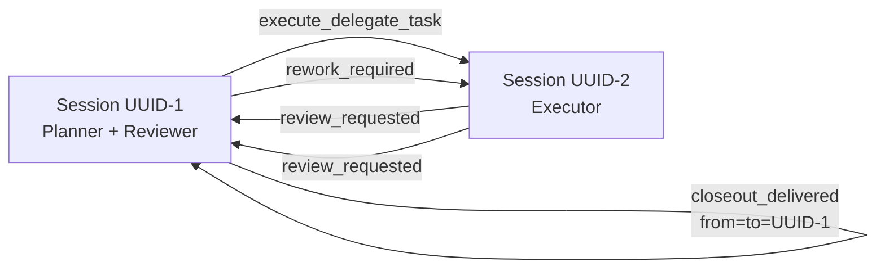
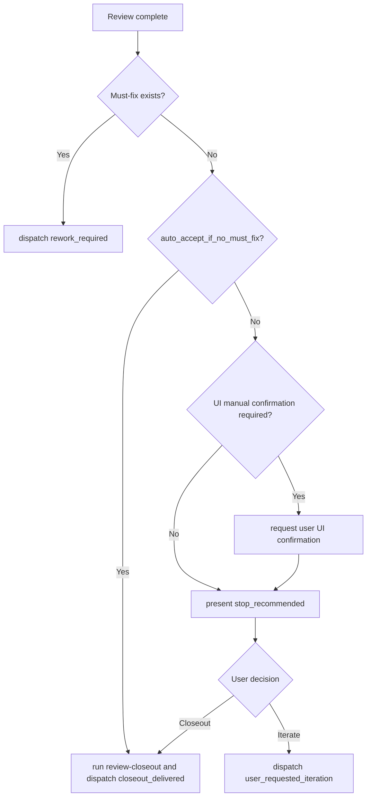

# Agent Deck Workflow

Use this skill as the single source of truth for three-role workflow protocol:
`planner` (long-lived), `executor` (per-task), `reviewer` (per-task).

This workflow does not require loading the official `agent-deck` skill by default.
The cloned official `agent-deck` skill is a local reference library (`references/`) only.

## Terminology

- `task_id`: stable task identifier (`YYYYMMDD-HHMM-<slug>`)
- `*_session_id`: Agent Deck session UUID (resolve with `agent-deck session show <session_id_or_ref> --json | jq -r '.id'`)
- `*_session_ref`: Human-friendly session reference (`title` or `id`)
- `workflow_policy`: optional per-task automation override; absent means human-gated defaults
- `special_requirements`: optional free-form fallback requirements from user/planner; carry unchanged across all roles for the same `task_id`

## Scope

- Workflow shape: one long-lived `planner`, per-task `executor` + `reviewer`.
- Runtime shape: single shared workspace.
- Governance: human-led; user confirmation gates remain required at stop/closeout points unless policy override is present.
- Git approval exception: in delegated executor flow, task-scoped executor commits are allowed without per-commit user approval.

## Shared Protocol (For All Workflow Skills)

### Agent Deck Mode Detection

Enter Agent Deck mode when any condition matches:
1. explicit `task_id` or `planner_session_id`
2. inbound context/artifact already carries Agent Deck metadata
3. user explicitly asks for agent-deck workflow

`agent-deck session current --json` is best-effort context only and must run in host shell.
If it fails, continue with explicit/context metadata.

### Context Resolution Priority

Use this priority chain for each field:
`explicit input -> parsed workflow context/artifact -> deterministic default -> ask one short clarification question`

Session identity nuance:
- `planner_session_id` must come from explicit/context workflow metadata.
- `current_session_id` is used for sender identity verification and role safety checks.
- Before identity comparisons, resolve all session refs/titles to UUIDs:
  - explicit refs: `agent-deck session show <ref> --json | jq -r '.id'`
  - current session: `agent-deck session current --json | jq -r '.id'`
- Exception (`delegate-task` only): planner sender legitimately equals current session, so `planner_session_id` may start from detected `current_session_id`.
- In all other skills, `current_session_id` is not a replacement source for `planner_session_id`.

### Role vs Session Identity

- A session may hold multiple roles for the same task.
- `*_session_id` fields identify which session currently holds each role mapping.
- When `from_session_id == to_session_id`, this represents inter-role communication within one session.
- Dispatch is skipped only when the target session is the current session (local continuation); otherwise dispatch proceeds.

### Session-Role Mapping Example



### Dispatch Helper Usage (Workflow Helpers)

Use workflow helpers only from this skill directory:
- `scripts/dispatch-control-message.sh`
- `scripts/planner-closeout-batch.sh`
- `scripts/closeout-health-gate.sh`
- `scripts/archive-and-remove-task-sessions.sh`
- `scripts/notify-workflow-event.sh`
- `scripts/summarize-ui-confirmation-packages.sh`

Path rules:
1. resolve helper path relative to this skill directory
2. use `~/.config/ai-agent/skills/agent-deck-workflow/scripts/<helper>.sh` form in commands and user-facing recommendations
3. do not run bare `scripts/...` or project-root `scripts/...` for workflow helpers
4. stop and ask user to attach/install this skill if unresolved

Canonical CLI flags are `--*-session-id`:
- `--planner-session-id`
- `--from-session-id`
- `--to-session-id`

### Control Message Contract

- Use this section as the routine source of truth during workflow execution; do not open `references/` for normal execution.
- Control message envelope:
  - `preconditions.must_fully_load_skills`: must include `agent-deck-workflow`
  - `execution.action`: workflow action name
  - `execution.artifact_path`: source-of-truth file path under `.agent-artifacts/`
  - `execution.note`: optional short instruction; when present it should explicitly tell receiver what workflow action to take next
  - `context.task_id`, `context.round`, `context.planner_session_id`, `context.from_session_id`, `context.to_session_id`: required context fields
  - `context.workflow_policy`, `context.special_requirements`: optional pass-through fields; preserve unchanged within the same task
- Sender invariants:
  - `execute_delegate_task`: sender is planner
  - `review_requested`: sender is executor
  - `rework_required`, `user_requested_iteration`, `closeout_delivered`: sender is reviewer
  - never default sender to planner for non-planner actions
- Action contract:
  - `execute_delegate_task`: planner starts delegated implementation
  - `review_requested`: executor asks reviewer to run full review and reviewer must proactively send the next control message
  - `rework_required`: reviewer blocks and sends must-fix follow-up to executor
  - `stop_recommended`: reviewer reports no must-fix items and waits for user closeout vs iterate decision
  - `user_requested_iteration`: reviewer forwards user's iterate decision to executor
  - `closeout_delivered`: reviewer sends accepted closeout to planner
- `references/control-message-semantics.md` and `references/internal-protocol/control-message-json-protocol.md` are optional protocol appendices for debugging/maintenance only.

Control JSON is internal protocol data by default.
User-facing responses should provide readable decisions and artifact pointers, not raw JSON payloads.

### Error Handling and Diagnostics

If dispatch helper fails, report concise stderr summary and run these checks:
1. Is `agent-deck-workflow` skill path resolvable?
2. Is sender/target session reachable? (`agent-deck session show <session_id_or_ref> --json`)
3. Is command running in correct tmux/session context? (`agent-deck session current --json`)
4. Is artifact path valid and under `.agent-artifacts/`?

If closeout cleanup fails, include:
1. blocked reason (`provider_guard_blocked`, `manual_close_required`, `worker_cap_exceeded`)
2. health report path (`.agent-artifacts/workflow-health/health-<task_id>.json`)
3. exact manual action to unblock (for example `agent-deck remove <session_id>`)

Planner closeout execution rule:
1. required actions (`merge`, `progress update`) are hard requirements
2. optional actions (`notify`, `next-task dispatch`, hygiene summaries) are best-effort
3. optional-action failures must not roll back or block required closeout completion

### Reviewer Decision Flow



## Automation Policy Override (Optional)

Default behavior is human-gated.

Planner may include per-task `workflow_policy`, for example:

```json
{
  "mode": "unattended",
  "auto_accept_if_no_must_fix": true,
  "auto_dispatch_next_task": true,
  "ui_manual_confirmation": "auto"
}
```

Rules:
- If absent, apply human-gated defaults.
- If present, executor and reviewer carry it forward unchanged for the same `task_id`.
- If `special_requirements` is present in context, planner/executor/reviewer carry it forward unchanged for the same `task_id`.
- Safety checks and must-fix handling remain unchanged.
- Unattended mode (`mode=unattended` or `auto_dispatch_next_task=true`) enables strict post-closeout health gate.

`ui_manual_confirmation`:
- `auto` (default): detect likely UI impact heuristically
- `required`: always require manual UI confirmation in human-gated mode
- `skip`: skip manual UI confirmation requirement

## Execution Environment (Required)

All `agent-deck` commands must run in host shell (outside sandbox) to keep real tmux/session context.
When workflow commands create Claude sessions via `--cmd`, use `claude --permission-mode acceptEdits` (not bare `claude`).

## Skill-Local Script Dependency (Required)

Workflow helpers in this skill:
- `scripts/dispatch-control-message.sh`
- `scripts/planner-closeout-batch.sh`
- `scripts/closeout-health-gate.sh`
- `scripts/archive-and-remove-task-sessions.sh`
- `scripts/notify-workflow-event.sh`
- `scripts/summarize-ui-confirmation-packages.sh` (planner summary helper)

Dispatch notification filtering:
- `ADWF_DISPATCH_NOTIFY=milestone` (default)
- `ADWF_DISPATCH_NOTIFY=all`
- `ADWF_DISPATCH_NOTIFY=none`

Debug logging:
- `ADWF_DEBUG=1` enables helper-script diagnostic logs.

## Relationship with Official Skill Clone

- Do not modify cloned official `agent-deck` skill for project-specific behavior.
- Do not require loading official `agent-deck` skill in normal execution.
- Use official clone references only when command details are needed; skill-local `references/` files are optional appendices and are not required for routine execution.

## Task Metadata Convention

Use stable naming:

- Executor session: `executor-<task_id>`
- Reviewer session: `reviewer-<task_id>`
- Branch: `task/<task_id>`
- Artifacts root: `.agent-artifacts/<task_id>/`
- `.agent-artifacts/` stores inter-agent communication records and workflow state artifacts; ignore it in normal coding/docs work, and inspect it only for postmortem or workflow-debug investigations.

## Human-Led Three-Role Flow

### 1) Planner Starts Task

- Planner prepares delegate artifact.
- Planner dispatches `execute_delegate_task` to executor.

### 2) Executor Implements and Requests Review

- Executor implements and commits first delivery.
- Executor dispatches `review_requested` to reviewer.
- Executor enters waiting state and does not proactively poll reviewer unless user asks.

### 3) Reviewer Loop

Reviewer chooses one branch:

1. `rework_required`
- dispatch to executor
- executor fixes and sends next `review_requested`

2. `stop_recommended`
- provide user-facing summary and wait for user decision
- if `workflow_policy.auto_accept_if_no_must_fix=true`, reviewer may skip waiting and run closeout
- in human-gated mode, request manual UI confirmation when required by policy

### 4) Planner Closeout Batch (After Acceptance)

After closeout acceptance (explicit user or unattended policy):
1. run `~/.config/ai-agent/skills/agent-deck-workflow/scripts/planner-closeout-batch.sh` for required closeout actions
2. required in script: merge `task/<task_id>` into integration branch
3. required in script: update progress record
4. optional in script: hygiene (`prune-task-branches.sh`, `summarize-ui-confirmation-packages.sh`)
5. optional in script: dispatch next task

If `workflow_policy.auto_dispatch_next_task=true`, planner may auto-dispatch next queued task after merge + progress update.

Recommended planner invocation:

```bash
~/.config/ai-agent/skills/agent-deck-workflow/scripts/planner-closeout-batch.sh \
  --task-id "<task_id>" \
  --integration-branch "<integration_branch>" \
  --run-health-gate
```

If next-task dispatch is configured, pass it as `--next-dispatch-cmd "<command>"`.
Even when that command fails, required closeout actions remain completed.

## Example: Complete Task Flow

1. User asks: "Add login rate limiting".
2. Planner runs `delegate-task`; artifact `.agent-artifacts/<task_id>/delegate-task-<task_id>.md` is generated.
3. Planner dispatches `execute_delegate_task` to `executor-<task_id>`.
4. Executor implements, commits, runs `review-request`, and dispatches `review_requested`.
5. Reviewer runs `review-code` and dispatches `rework_required` (if must-fix exists).
6. Executor fixes and sends another `review_requested`.
7. Reviewer approves, user confirms, reviewer runs `review-closeout` and dispatches `closeout_delivered`.
8. Planner merges branch and updates progress.

## Role-Skill Mapping

- Planner: `delegate-task`, `handoff`
- Executor: `review-request`
- Reviewer: `review-code`, `review-closeout`
- Roles are task-scoped; one AI/session may assume multiple roles when workflow context explicitly assigns them.

## Do / Do Not

Do:
- keep long context file-based (`delegate-task`, `review-request`, `review-report`, `closeout`)
- keep cross-session messages short and pointer-based
- keep human confirmation gates in human-gated mode
- run planner required closeout actions via `~/.config/ai-agent/skills/agent-deck-workflow/scripts/planner-closeout-batch.sh`

Do not:
- auto-merge before acceptance
- send large report bodies inline via `session send`
- run proactive polling loops after dispatch
- treat protocol JSON as default user-facing content
- block `merge + progress update` on optional notify/dispatch failures
