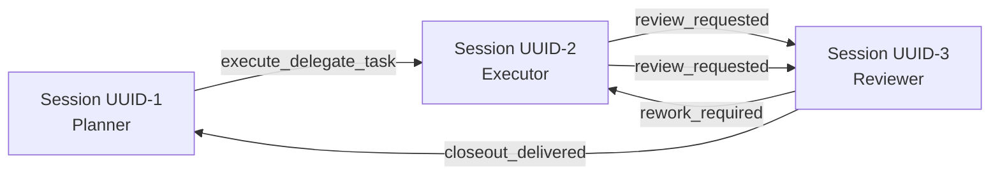
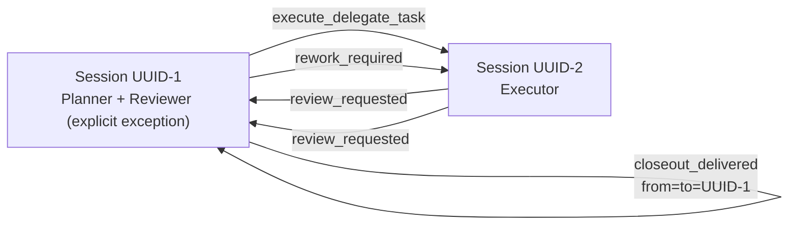

# Agent Deck Workflow

Use this skill as the single source of truth for three-role workflow protocol:
`planner` (long-lived), `executor` (per-task), `reviewer` (per-task).

Default role/session rule:
- use one distinct session per role
- treat planner/reviewer same-session operation as an explicit exception, not an implied default

This workflow does not require loading the official `agent-deck` skill by default.
The cloned official `agent-deck` skill is a local reference library (`references/`) only.

## Terminology

- `task_id`: stable task identifier (`YYYYMMDD-HHMM-<slug>`)
- `*_session_id`: Agent Deck session UUID (resolve with `agent-deck session show <session_id_or_ref> --json | jq -r '.id'`)
- `*_session_ref`: Human-friendly session reference (`title` or `id`)
- `start_branch`: planner's current git branch when `delegate-task` begins
- `integration_branch`: branch where accepted work must land at closeout; this is the task-local mainline and is not assumed to be `main`/`master`
- `task_branch`: executor working branch; may be a dedicated `task/<task_id>` branch or a reused existing topic branch
- `workflow_policy`: optional per-task automation override; absent means human-gated defaults
- `special_requirements`: optional free-form fallback requirements from user/planner; carry unchanged across all roles for the same `task_id`

## Scope

- Workflow shape: one long-lived `planner`, per-task `executor` + `reviewer`.
- Default session mapping: planner, executor, and reviewer are separate sessions.
- Same-session planner+reviewer is allowed only when explicitly assigned by workflow context.
- Runtime shape: single shared workspace.
- Governance: human-led; user confirmation gates remain required at stop/closeout points unless policy override is present.
- Git approval exception: in delegated executor flow, task-scoped executor commits are allowed without per-commit user approval.

## Shared Protocol (For All Workflow Skills)

### Agent Deck Mode Detection

Enter Agent Deck mode when any condition matches:
1. explicit `task_id` or `planner_session_id`
2. inbound context/artifact already carries Agent Deck metadata
3. user explicitly asks for agent-deck workflow

`agent-deck session current --json` is best-effort context only and must run in host shell.
If it fails, continue with explicit/context metadata.

### Context Resolution Priority

Use this priority chain for each field:
`explicit input -> parsed workflow context/artifact -> deterministic default -> ask one short clarification question`

Session identity nuance:
- `planner_session_id` must come from explicit/context workflow metadata.
- `current_session_id` is used for sender identity verification and role safety checks.
- Before identity comparisons, resolve all session refs/titles to UUIDs:
  - explicit refs: `agent-deck session show <ref> --json | jq -r '.id'`
  - current session: `agent-deck session current --json | jq -r '.id'`
- Exception (`delegate-task` only): planner sender legitimately equals current session, so `planner_session_id` may start from detected `current_session_id`.
- In all other skills, `current_session_id` is not a replacement source for `planner_session_id`.

### Role vs Session Identity

- Default mapping is one distinct session per role: `planner_session_id`, `executor_session_id`, and `reviewer_session_id` should differ unless workflow context explicitly assigns an exception.
- A session may hold multiple roles for the same task only when workflow context explicitly assigns that multi-role mapping.
- `*_session_id` fields identify which session currently holds each role mapping.
- Tool/provider choice is separate from session identity.
- Saying "reviewer uses codex" means "the reviewer session should be created or resumed with a Codex command", not "the current Codex planner/executor session should self-assign reviewer role".
- Even when planner and reviewer use the same provider/model/command, keep a distinct reviewer session unless same-session reviewer assignment is explicitly stated in workflow context.
- When `from_session_id == to_session_id`, this is an explicit local same-session continuation already established by workflow context, not something inferred from matching tool names.
- Dispatch is skipped only when the target session is the current session (local continuation); otherwise dispatch proceeds.

### Branch Roles and Resolution

- Resolve branch roles when planner creates the delegate artifact, not during closeout.
- `integration_branch` is the branch that accepted work merges into. It is the task-local mainline and may be `develop`, `release/*`, another feature branch, or anything else the task actually targets.
- `task_branch` is the branch where executor commits. In the normal merge-based flow it must differ from `integration_branch`.
- Deterministic default order:
  1. preserve explicit/context branch values when already provided
  2. detect `start_branch` from planner's current branch when `delegate-task` begins
  3. if `start_branch` is the intended landing line for this delegated change, set `integration_branch = start_branch` and default `task_branch = task/<task_id>`
  4. if `start_branch` is already the intended topic branch for this delegated change, reuse it as `task_branch` and resolve `integration_branch` from explicit user intent or a high-confidence tracked/base branch; if confidence is low, ask one short clarification instead of guessing
- Never assume `master` or `main` unless the task's actual landing branch resolves there.
- Once delegate artifact records `start_branch`, `integration_branch`, and `task_branch`, later roles should treat that branch plan as immutable task context unless user explicitly changes it.
- Planner should pass explicit `--task-branch` and `--integration-branch` to `planner-closeout-batch.sh` whenever that branch plan is known.

### Session-Role Mapping Example



Explicit exception example:



### Dispatch Helper Usage (Workflow Helpers)

Use workflow helpers only from this skill directory:
- `scripts/dispatch-control-message.sh`
- `scripts/planner-closeout-batch.sh`
- `scripts/closeout-health-gate.sh`
- `scripts/archive-and-remove-task-sessions.sh`
- `scripts/notify-workflow-event.sh`
- `scripts/summarize-ui-confirmation-packages.sh`

Path rules:
1. resolve helper path relative to this skill directory
2. use `~/.config/ai-agent/skills/agent-deck-workflow/scripts/<helper>.sh` form in commands and user-facing recommendations
3. do not run bare `scripts/...` or project-root `scripts/...` for workflow helpers
4. stop and ask user to attach/install this skill if unresolved

Canonical CLI flags are `--*-session-id`:
- `--planner-session-id`
- `--from-session-id`
- `--to-session-id`

### Control Message Contract

- Use this section as the routine source of truth during workflow execution; do not open `references/` for normal execution.
- Control message envelope:
  - `preconditions.must_fully_load_skills`: must include `agent-deck-workflow`
  - `execution.action`: workflow action name
  - `execution.artifact_path`: source-of-truth file path under `.agent-artifacts/`
  - `execution.note`: optional short instruction; when present it should explicitly tell receiver what workflow action to take next
  - `context.task_id`, `context.round`, `context.planner_session_id`, `context.from_session_id`, `context.to_session_id`: required context fields
  - `context.workflow_policy`, `context.special_requirements`: optional pass-through fields; preserve unchanged within the same task
- Sender invariants:
  - `execute_delegate_task`: sender is planner
  - `review_requested`: sender is executor
  - `rework_required`, `user_requested_iteration`, `closeout_delivered`: sender is reviewer
  - never default sender to planner for non-planner actions
- Action contract:
  - `execute_delegate_task`: planner starts delegated implementation
  - `review_requested`: executor asks reviewer to run full review and reviewer must proactively send the next control message
  - `rework_required`: reviewer blocks and sends must-fix follow-up to executor
  - `stop_recommended`: reviewer reports no must-fix items and waits for user closeout vs iterate decision
  - `user_requested_iteration`: reviewer forwards user's iterate decision to executor
  - `closeout_delivered`: reviewer sends accepted closeout to planner; planner should treat the closeout and underlying review report as planning input for residual follow-up tracking, not as a default reason to reopen accepted review
- Review disagreement policy:
  - reviewer findings are advisory, not automatically binding on executor
  - executor must evaluate reviewer findings critically and adopt only the changes that are technically justified
  - when executor disagrees, the next `review_requested` artifact should state the disagreement and rationale clearly
  - if executor and reviewer cannot converge, either role may stop and ask user for a decision
- `references/control-message-semantics.md` and `references/internal-protocol/control-message-json-protocol.md` are optional protocol appendices for debugging/maintenance only.

Control JSON is internal protocol data by default.
User-facing responses should provide readable decisions and artifact pointers, not raw JSON payloads.

### Error Handling and Diagnostics

If dispatch helper fails, report concise stderr summary and run these checks:
1. Is `agent-deck-workflow` skill path resolvable?
2. Is sender/target session reachable? (`agent-deck session show <session_id_or_ref> --json`)
3. Is command running in correct tmux/session context? (`agent-deck session current --json`)
4. Is artifact path valid and under `.agent-artifacts/`?

If closeout cleanup fails, include:
1. blocked reason (`provider_guard_blocked`, `manual_close_required`, `worker_cap_exceeded`)
2. health report path (`.agent-artifacts/workflow-health/health-<task_id>.json`)
3. exact manual action to unblock (for example `agent-deck remove <session_id>`)

Planner closeout execution rule:
1. required actions (`merge`, `progress update`) are hard requirements
2. optional actions (`notify`, `next-task dispatch`, hygiene summaries) are best-effort
3. optional-action failures must not roll back or block required closeout completion
4. when `--integration-branch` is provided, `planner-closeout-batch.sh` is responsible for switching to that branch before merge if the worktree is in a safe state
5. planner should not run git state-changing commands in parallel with `planner-closeout-batch.sh`

Planner post-acceptance interpretation rule:
1. `closeout_delivered` means accepted review loop complete; normal closeout should proceed
2. planner must inspect the closeout artifact and any referenced review report before finalizing follow-up planning
3. non-blocking accepted findings (for example design concerns, minor suggestions, verification questions, or accepted `FAIL`/`UNKNOWN` checks) should be evaluated as inputs to progress/todo updates or next-task planning
4. planner should decide whether each residual item needs explicit tracking, a queued next task/subtask, or no extra tracking
5. planner should not reopen the accepted task by default unless the artifact clearly shows a must-fix issue was accepted by mistake or new contradictory evidence appears

### Reviewer Decision Flow

Reviewer decision rules:

1. If must-fix items exist, dispatch `rework_required` to executor.
2. If no must-fix items exist and `workflow_policy.auto_accept_if_no_must_fix=true`, run `review-closeout` and dispatch `closeout_delivered` to planner.
3. Otherwise, present `stop_recommended` to user and wait for user decision. Do not send `stop_recommended` to planner.
4. If user chooses closeout, run `review-closeout` and dispatch `closeout_delivered` to planner.
5. If user chooses another iteration, dispatch `user_requested_iteration` to executor.

## Automation Policy Override (Optional)

Default behavior is human-gated.

Planner may include per-task `workflow_policy`, for example:

```json
{
  "mode": "unattended",
  "auto_accept_if_no_must_fix": true,
  "auto_dispatch_next_task": true,
  "ui_manual_confirmation": "auto"
}
```

Rules:
- If absent, apply human-gated defaults.
- If present, executor and reviewer carry it forward unchanged for the same `task_id`.
- If `special_requirements` is present in context, planner/executor/reviewer carry it forward unchanged for the same `task_id`.
- Safety checks and must-fix handling remain unchanged.
- Unattended mode (`mode=unattended` or `auto_dispatch_next_task=true`) enables strict post-closeout health gate.

`ui_manual_confirmation`:
- `auto` (default): detect likely UI impact heuristically
- `required`: always require manual UI confirmation in human-gated mode
- `skip`: skip manual UI confirmation requirement

## Execution Environment (Required)

All `agent-deck` commands must run in host shell (outside sandbox) to keep real tmux/session context.
When workflow commands create sessions via `--cmd`, do not use bare provider names.
Use full recommended commands unless the user explicitly supplied a different full command:
- Claude: `claude --model sonnet --permission-mode acceptEdits`
- Codex: `codex --model gpt-5.4 --ask-for-approval on-request`
- Gemini: `gemini --model gemini-2.5-pro`

## Skill-Local Script Dependency (Required)

Workflow helpers in this skill:
- `scripts/dispatch-control-message.sh`
- `scripts/planner-closeout-batch.sh`
- `scripts/closeout-health-gate.sh`
- `scripts/archive-and-remove-task-sessions.sh`
- `scripts/notify-workflow-event.sh`
- `scripts/summarize-ui-confirmation-packages.sh` (planner summary helper)

Dispatch notification filtering:
- `ADWF_DISPATCH_NOTIFY=milestone` (default)
- `ADWF_DISPATCH_NOTIFY=all`
- `ADWF_DISPATCH_NOTIFY=none`

Debug logging:
- `ADWF_DEBUG=1` enables helper-script diagnostic logs.

## Relationship with Official Skill Clone

- Do not modify cloned official `agent-deck` skill for project-specific behavior.
- Do not require loading official `agent-deck` skill in normal execution.
- Use official clone references only when command details are needed; skill-local `references/` files are optional appendices and are not required for routine execution.

## Task Metadata Convention

Use stable naming:

- Executor session: `executor-<task_id>`
- Reviewer session: `reviewer-<task_id>`
- Default dedicated task branch: `task/<task_id>`
- Default integration branch: planner's current branch at delegate creation when that branch is the intended landing line
- Existing topic branch reuse: allowed when planner determines the current branch already is the correct `task_branch`
- Artifacts root: `.agent-artifacts/<task_id>/`
- `.agent-artifacts/` stores inter-agent communication records and workflow state artifacts; ignore it in normal coding/docs work, and inspect it only for postmortem or workflow-debug investigations.

## Human-Led Three-Role Flow

### 1) Planner Starts Task

- Planner prepares delegate artifact.
- Planner resolves and records branch plan (`start_branch`, `integration_branch`, `task_branch`) in that artifact before dispatch.
- Planner dispatches `execute_delegate_task` to executor.

### 2) Executor Implements and Requests Review

- Executor implements and commits first delivery.
- Executor dispatches `review_requested` to reviewer.
- Executor enters waiting state and does not proactively poll reviewer unless user asks.

### 3) Reviewer Loop

Reviewer chooses one branch:

1. `rework_required`
- dispatch to executor
- executor evaluates the findings critically, applies the technically justified changes, and may disagree with specific points
- next `review_requested` should summarize any disagreement or partial adoption clearly
- if executor and reviewer cannot converge, either may stop and ask user for a decision

2. `stop_recommended`
- provide user-facing summary to user and wait for user decision
- do not send `stop_recommended` to planner; this is the user decision point
- if `workflow_policy.auto_accept_if_no_must_fix=true`, reviewer may skip waiting and run closeout
- in human-gated mode, request manual UI confirmation when required by policy

### 4) Planner Closeout Batch (After Acceptance)

After closeout acceptance (explicit user or unattended policy):
1. inspect `closeout-<task_id>.md` and any referenced `review-report-r<n>.md`
2. decide whether residual accepted findings require follow-up tracking (`progress`, `todo`, next-task queue, or no action)
3. reuse recorded branch plan (`task_branch`, `integration_branch`); do not silently re-infer a different merge target if the delegate/closeout artifacts already define it
4. run `~/.config/ai-agent/skills/agent-deck-workflow/scripts/planner-closeout-batch.sh` for required closeout actions, passing explicit `--task-branch` and `--integration-branch` when known
5. if `--integration-branch` is provided and current branch differs, the script should switch to the integration branch itself; planner should not pre-stage a parallel `git switch`
6. required in script: merge recorded `task_branch` into recorded `integration_branch`
7. required in script: update progress record
8. optional in script: hygiene (`prune-task-branches.sh`, `summarize-ui-confirmation-packages.sh`)
9. optional in script: dispatch next task

If `workflow_policy.auto_dispatch_next_task=true`, planner may auto-dispatch next queued task after merge + progress update.
When planner is dispatching from a known queued batch/plan, planner must proactively report queue progress before each new dispatch in `current/total` form (for example `3/15`).
This progress is planner-owned state; workflow helper scripts must not invent or infer it.
If planner knows the queue is ordered but does not know the total yet, say that explicitly instead of fabricating a ratio.

Recommended planner invocation:

```bash
~/.config/ai-agent/skills/agent-deck-workflow/scripts/planner-closeout-batch.sh \
  --task-id "<task_id>" \
  --task-branch "<task_branch>" \
  --integration-branch "<integration_branch>" \
  --run-health-gate
```

If next-task dispatch is configured, pass it as `--next-dispatch-cmd "<command>"`.
Even when that command fails, required closeout actions remain completed.

Planner user-facing status contract for auto-dispatch:
- before each auto-dispatched task, show one short status line that includes the next dispatch progress
- preferred format: `Auto-dispatch progress: <current>/<total> | next task: <task_id_or_short_title>`
- if total is unknown, use an explicit unknown-total form such as `Auto-dispatch progress: 3/?`
- do not delegate this responsibility to `planner-closeout-batch.sh` or `dispatch-control-message.sh`; they do not own queue state

## Example: Complete Task Flow

1. User asks: "Add login rate limiting".
2. Planner runs `delegate-task`; artifact `.agent-artifacts/<task_id>/delegate-task-<task_id>.md` is generated with recorded `start_branch`, `integration_branch`, and `task_branch`.
3. Planner dispatches `execute_delegate_task` to `executor-<task_id>`.
4. Executor implements on recorded `task_branch`, commits, runs `review-request`, and dispatches `review_requested`.
5. Reviewer runs `review-code` and dispatches `rework_required` (if must-fix exists).
6. Executor fixes and sends another `review_requested`.
7. Reviewer approves, user confirms, reviewer runs `review-closeout` and dispatches `closeout_delivered`.
8. Planner merges recorded `task_branch` into recorded `integration_branch` and updates progress.

## Role-Skill Mapping

- Planner: `delegate-task`, `handoff`
- Executor: `review-request`
- Reviewer: `review-code`, `review-closeout`
- Roles are task-scoped; same-session multi-role assignment is an explicit exception and must be stated in workflow context rather than inferred from provider/tool choice.

## Do / Do Not

Do:
- keep long context file-based (`delegate-task`, `review-request`, `review-report`, `closeout`)
- keep cross-session messages short and pointer-based
- keep human confirmation gates in human-gated mode
- treat accepted review residuals as planning input for follow-up tracking rather than silently discarding them
- resolve and record branch plan at delegate start, then reuse it consistently through closeout
- let `planner-closeout-batch.sh` own integration-branch switching when `--integration-branch` is explicitly supplied
- run planner required closeout actions via `~/.config/ai-agent/skills/agent-deck-workflow/scripts/planner-closeout-batch.sh`

Do not:
- auto-merge before acceptance
- run `git switch` in parallel with planner closeout
- assume the merge target is `main` or `master` when the recorded task mainline is something else
- blindly create `task/<task_id>` when the delegate artifact explicitly says to reuse an existing topic branch as `task_branch`
- silently re-derive merge target from whatever branch happens to be checked out at closeout time when branch plan was already recorded earlier
- send large report bodies inline via `session send`
- run proactive polling loops after dispatch
- treat protocol JSON as default user-facing content
- block `merge + progress update` on optional notify/dispatch failures
